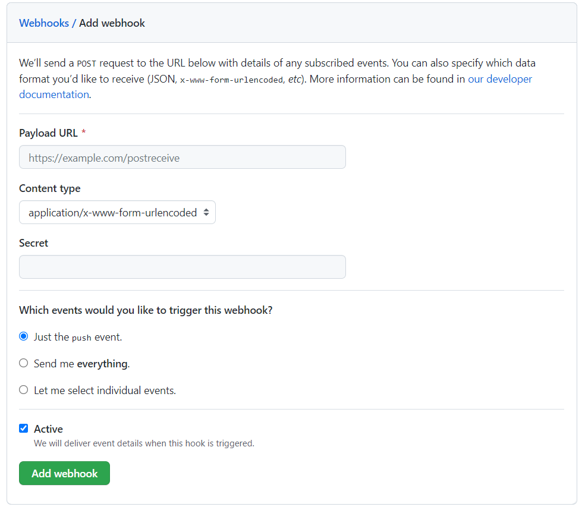

# GitAutoDeploy

## 部署
```
yarn install
```

## 修改配置文件

先复制样例配置
```
cp config.sample.json config.json
```

再根据需要修改 `config.json`

## 配置文件解释

```json
{
    "port": 3000,
    // 端口号
    "repository": {
    // 仓库列表 (可创建多个子节点)
        "GitAutoDeploy": {
        // 友好名称 (可自定义)
            "path": "./GitAutoDeploy",
            // 在本地部署的路径
            "command": [
                "git branch main",
                "git pull"
            ],
            // 部署的所有命令
            "token": "bb303c89282286b91e4086d7709cf76c"
            // 访问 Token (自定义，建议复杂一些)
        }
    }
}
```

## 配置 Webhook

> 以 `Github` 为例

在 `Settings` 找到 `Webhooks` 选项

点击 `Add Webhook`



`Payload URL` 中输入

```
http://公网IP:端口/?name=友好名称&token=设置的Token
```

样例配置的 `Payload URL` 如下

```
http://127.0.0.1:3000/?name=GitAutoDeploy&token=bb303c89282286b91e4086d7709cf76c
```

## 执行

可自行配置守护进程

```bash
node index.js
```
